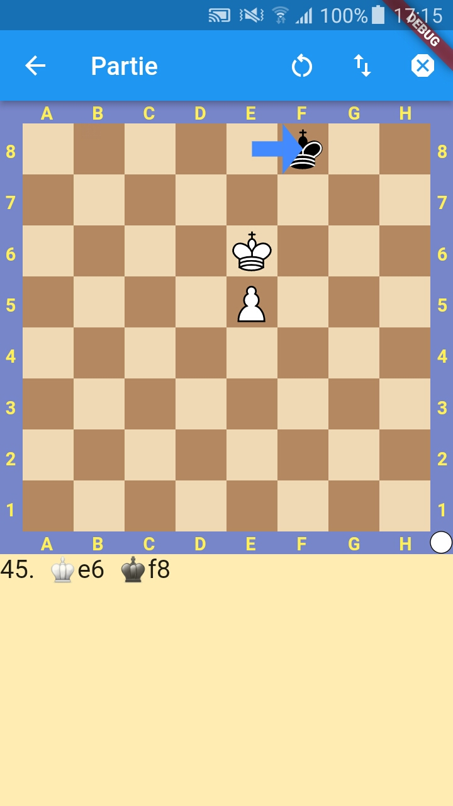

<!-- 
This README describes the package. If you publish this package to pub.dev,
this README's contents appear on the landing page for your package.

For information about how to write a good package README, see the guide for
[writing package pages](https://dart.dev/guides/libraries/writing-package-pages). 

For general information about developing packages, see the Dart guide for
[creating packages](https://dart.dev/guides/libraries/create-library-packages)
and the Flutter guide for
[developing packages and plugins](https://flutter.dev/developing-packages). 
-->

A simple chess board widget, with several options.

## Features



A simple chess board, where:
* you can configure the current position,
* you can configure each side type (e.g : we can drag pieces for white side, but block them for black side if we want to make an external engine move),
* you can show coordinates and player turn around the board,
* you define your own widget for processing with promotion piece selection,
* you can choose the orientation of the board (are Blacks at bottom ?),
* you can add arrows.

If you want to implement game logic, you can use the [chess](https://pub.dev/packages/chess) package.

## Getting started

TODO: List prerequisites and provide or point to information on how to
start using the package.

## Usage

TODO: Include short and useful examples for package users. Add longer examples
to `/example` folder. 

### Simple example

```dart
SimpleChessBoard(
    engineThinking: false,
    fen: '8/8/8/4p1K1/2k1P3/8/8/8 b - - 0 1',
    onMove: ({required ShortMove move}){
        print('${move.from}|${move.to}|${move.promotion}')
    },
    orientation: BoardColor.black,
    whitePlayerType: PlayerType.human,
    blackPlayerType: PlayerType.computer,
    lastMoveToHighlight: BoardArrow(from: 'e2', to: 'e4', color: Colors.blueAccent),
    onPromote: () => PieceType.queen,
),
```

### Handling promotion

You handle promotion in the function you give to the mandatory `onPromote` parameter. In this function you return the `PieceType` you want to use.

As an example:

```dart
SimpleChessBoard(
    engineThinking: false,
    fen: '1k6/p2KP3/1p6/8/4B3/8/8/8 w - - 0 1',
    onMove: ({required ShortMove move}){
        print('${move.from}|${move.to}|${move.promotion}')
    },
    orientation: BoardColor.white,
    whitePlayerType: PlayerType.human,
    blackPlayerType: PlayerType.computer,
    lastMoveToHighlight: BoardArrow(from: 'e2', to: 'e4', color: Colors.blueAccent),
        onPromote: () {
            return showDialog<PieceType>(
            context: context,
            builder: (_) {
                return AlertDialog(
                title: Text('Promotion'),
                content: Column(
                    mainAxisSize: MainAxisSize.min,
                    children: [
                            ListTile(
                                title: Text("Queen"),
                                onTap: () => navigator.pop(PieceType.queen),
                            ),
                            ListTile(
                                title: Text("Rook"),
                                onTap: () => navigator.pop(PieceType.rook),
                            ),
                            ListTile(
                                title: Text("Bishop"),
                                onTap: () => navigator.pop(PieceType.bishop),
                            ),
                            ListTile(
                                title: Text("Knight"),
                                onTap: () => navigator.pop(PieceType.knight),
                            ),
                        ],
                    ),
                );
            },
        );
    },
)
```

### Parameters

* fen : board position in [Forsyth-Edwards Notation](https://en.wikipedia.org/wiki/Forsyth%E2%80%93Edwards_Notation). Example : `rnbqkbnr/pppppppp/8/8/4P3/8/PPPP1PPP/RNBQKBNR b KQkq e3 0 1`.
* orientation: says if Black side is at bottom or not. Give `BoardColor.black` if Blacks must be at bottom of the board, or `BoardColor.white` otherwise.
* whitePlayerType : if it is white turn and this is set to `PlayerType.human`, then the user will be able to move pieces. Either with the click method, or with the drag and drop method. Otherwise, if set to `PlayerType.computer` and it is white turn, then the user won't be able to move pieces.
* blackPlayerType : if it is black turn and this is set to `PlayerType.human`, then the user will be able to move pieces. Either with the click method, or with the drag and drop method. Otherwise, if set to `PlayerType.computer` and it is black turn, then the user won't be able to move pieces.
* onMove : the given function will be called whenever a move is done on board by the user (if he's allowed to move pieces). It has a single `required` parameter `ShortMove move` which carries data about from/to cells, as well as promotion type which is nullable. **Notice that it's up to you to update the board or not based on the move you receive from this function.** You can use the [chess](https://pub.dev/packages/chess) package to get the new position.
* onPromote: the given function is called whenever a promotion move is done on board by the user (if he's allowed to move pieces). You must return a `Future<PieceType?>`. The `Future` can wrap a `null` value in order to cancel. Otherwise, wrap a `PieceType` such as `PieceType.queen`.
* showCoordinatesZone (optionnal) : says if you want to show coordinates and player turn around the board. Give `true` for showing it, or `false` for removing it.
* lastMoveToHighlight (optionnal) : give data about the arrow to draw on the board, if any. You pass a `BoardArrow` with from/to cells `String` and color `Color` (such as `BoardArrow(from: 'e2', to: 'e4', color: Colors.blueAccent)`) if you want to draw an arrow, or `null` if you don't want any arrow on the board.
* engineThinking (optionnal) : says if you want to show a `CircularProgressBar` in order to indicate that an engine is trying to compute next move for example.

## Additional information

TODO: Tell users more about the package: where to find more information, how to 
contribute to the package, how to file issues, what response they can expect 
from the package authors, and more.

## Credits

* Using code from [Flutter Chess board](https://github.com/varunpvp/flutter_chessboard).
* Using code from [Flutter Stateless Chess board](https://github.com/varunpvp/flutter_chessboard).